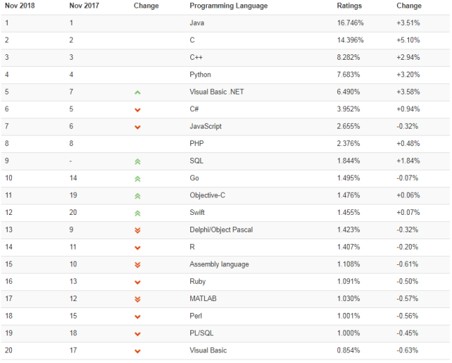

# 选择`C`语言的理由

&nbsp;&nbsp;&nbsp;&nbsp;&nbsp;&nbsp;&nbsp;在过去40多年里，`C`语言已经成为最重要、最流行的编程语言。很多人都从`C`语言	转而使用其他编程语言(C++,Objective-C,Java等)，但是`C`语言仍凭借自身实力在众多语言中脱颖而出。下面我么介绍较为突出的几点。

*TIOBE2018年11月编程语言排行榜,`C`语言位居第二*

