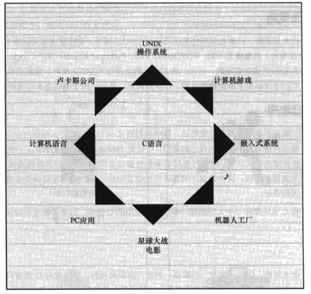

# `C`语言的应用范围

&nbsp;&nbsp;&nbsp;&nbsp;&nbsp;&nbsp;&nbsp;上世界80年代，`C`语言就已经成为小型计算机（`UNIX`操作系统）使用的主流语言。从那以后`C`语言的应用范围扩展到微型机（个人计算机）和大型机。许多公司都用`C`语言来开发文字处理程序、电子表格、编译器和其他产品，因为用`C`语言编写的程序紧凑而高效。更重要的是`C`程序很方便修改，而且移植到新型号的计算机中也没什么问题。

&nbsp;&nbsp;&nbsp;&nbsp;&nbsp;&nbsp;&nbsp;上世纪90年代，许多软件公司开始改用`C++`来开发大型的编程项目。`C++`在`C`语言的基础上嫁接了面向对象编程工具。`C++`几乎是`C`的超集，这意味着任何一个`C`程序差不多就是一个`C++`程序。

&nbsp;&nbsp;&nbsp;&nbsp;&nbsp;&nbsp;&nbsp;特别是，`C`语言已成为嵌入式系统编程的流行语言。也就是说越来越多的汽车、照相机、DVD播放机和其他现代化设备的微处理器都用	`C`语言进行编程。最终作为开发操作系统的卓越语言，`C`在`Linux`开发中扮演着及其重要的角色。

*`C`语言的应用范围*

